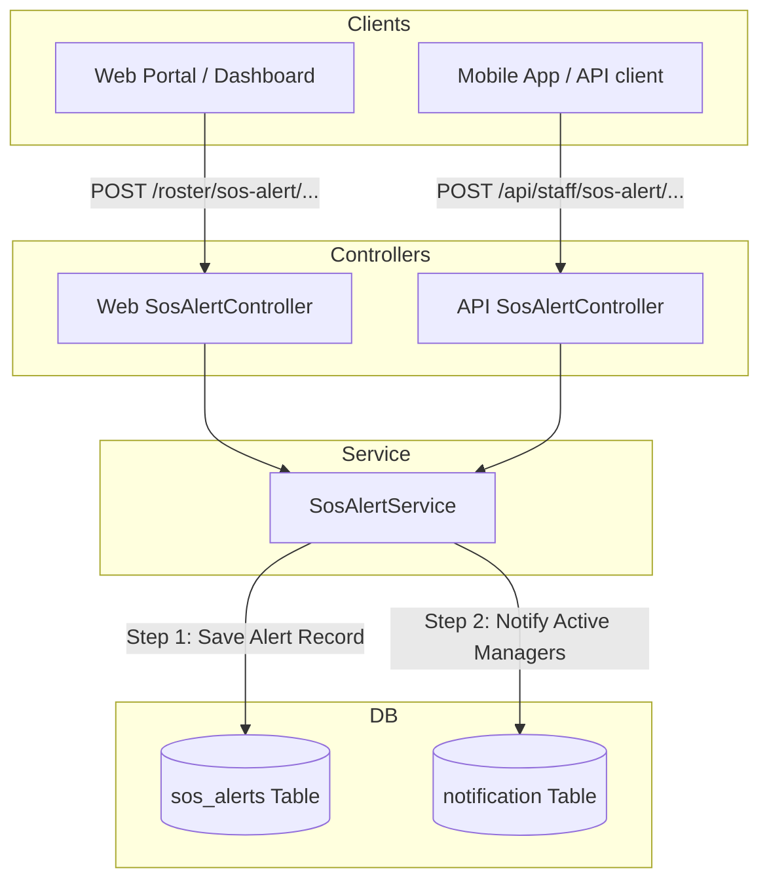
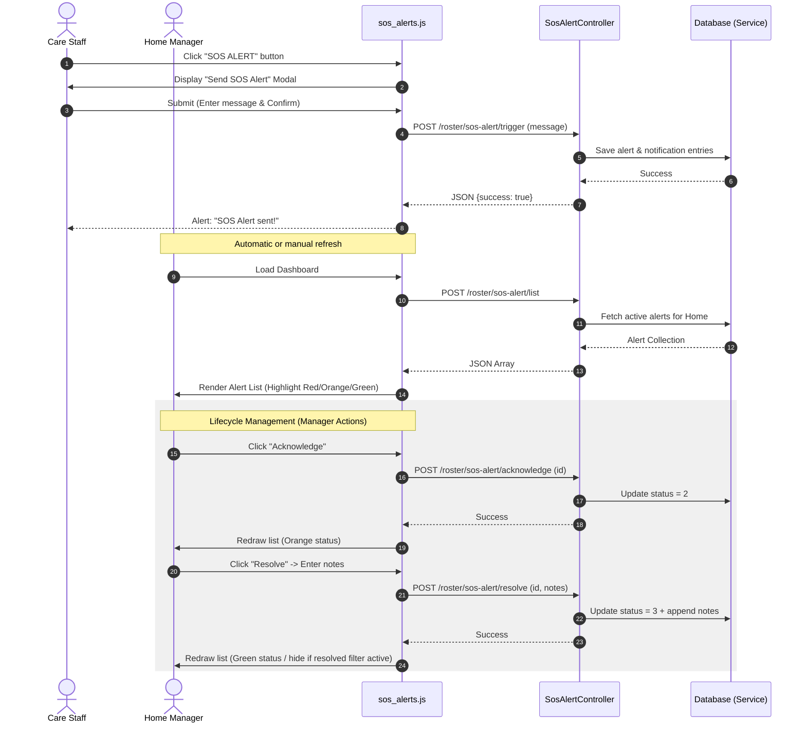

# SOS Alert Functionality Flow Documentation

This document describes the end-to-end architecture, database schema, backend services, endpoints, and frontend user flows for the **SOS Alert** functionality implemented within the SCITS (Social Care IT Solutions) application.

The SOS Alert feature allows on-duty care staff to trigger an emergency alert (via the Web Portal or Mobile App). This immediately creates a persistent emergency record, notifies all active home managers/admins via sticky in-app notifications, and tracks the lifecycle (Active -> Acknowledged -> Resolved) of the emergency.

---

## 1. System Overview & Architecture

The SOS Alert architecture consists of a decouple-first design where database state persistence is isolated from notifications, ensuring database logging succeeds even if the notification channel experiences failures.

---

## 2. Database Schema

The alerts are stored in the `sos_alerts` table. The status transitions through integer values:
*   **`1`** = **Active** (Pending action)
*   **`2`** = **Acknowledged** (Manager/Admin acknowledges but case remains open)
*   **`3`** = **Resolved** (Case is closed with resolution notes)

### Model Structure: [sosAlert.php](file:///c:/xampp/htdocs/socialcareitsolutions/app/Models/staffManagement/sosAlert.php)
*   **Table Name**: `sos_alerts`
*   **Attributes**:
    *   `staff_id`: Reference to `user.id` (Who triggered the alert)
    *   `home_id`: Reference to `home.id` (Contextual home location)
    *   `location`: String indicating source origin (e.g. `'Web Dashboard'`, `'Mobile App'`)
    *   `message`: Text description of the emergency or resolution notes
    *   `status`: Integer casted state (`1`, `2`, or `3`)
    *   `acknowledged_by`: Reference to `user.id` (Who acknowledged the alert)
    *   `acknowledged_at`: Datetime cast
    *   `resolved_by`: Reference to `user.id` (Who resolved the alert)
    *   `resolved_at`: Datetime cast
*   **Relationships**:
    *   `staff()`: BelongsTo [User](file:///c:/xampp/htdocs/socialcareitsolutions/app/User.php)
    *   `acknowledgedByUser()`: BelongsTo [User](file:///c:/xampp/htdocs/socialcareitsolutions/app/User.php)
    *   `resolvedByUser()`: BelongsTo [User](file:///c:/xampp/htdocs/socialcareitsolutions/app/User.php)
*   **Scopes**:
    *   `scopeActive()`: Filters out deleted records (`is_deleted = 0`)
    *   `scopeForHome($homeId)`: Scopes results to a specific care home

---

## 3. Core Business Service: [SosAlertService.php](file:///c:/xampp/htdocs/socialcareitsolutions/app/Services/Staff/SosAlertService.php)

All actions (trigger, list, acknowledge, resolve) are processed in the business logic layer [SosAlertService](file:///c:/xampp/htdocs/socialcareitsolutions/app/Services/Staff/SosAlertService.php).

### `trigger(int $staffId, int $homeId, ?string $message)`
1.  **Starts a Transaction**: Inserts the alert record immediately into `sos_alerts` with `status = 1` and `location = 'Web Dashboard'`.
2.  **Commit**: Immediately commits to DB to ensure record is saved first.
3.  **Dispatch Notifications**:
    *   Looks up active, non-deleted Managers (`M`) and Admins (`A`) mapped to the `$homeId` using `FIND_IN_SET(home_id)`.
    *   Constructs notification payload with `notification_event_type_id = 24`, `event_action = 'SOS_ALERT'`, and `is_sticky = 1`.
    *   Inserts notifications using a raw DB builder, detecting dynamically if `service_user_id` column exists. This safeguards the alert flow across different DB staging schemas.

### `list(int $homeId, int $limit = 10)`
Fetches active alerts scoped to `$homeId` with pre-loaded relationships (`staff`, `acknowledgedByUser`, `resolvedByUser`) ordered by descending ID.

### `acknowledge(int $id, int $homeId, int $userId)`
Updates the alert record matching the given `$id` and `$homeId`. Checks if the status is currently `1` (Active), then updates:
*   `status = 2` (Acknowledged)
*   `acknowledged_by = $userId`
*   `acknowledged_at = now()`

### `resolve(int $id, int $homeId, int $userId, ?string $notes = null)`
Closes the alert record. Checks if the status is active or acknowledged (`1` or `2`), then updates:
*   `status = 3` (Resolved)
*   `resolved_by = $userId`
*   `resolved_at = now()`
*   Appends the input `notes` value to the alert's `message` field (prefixing with `\n\nResolution: ` if a message already exists).

---

## 4. Web vs. Mobile API Endpoints

The feature exposes parallel endpoints for Web Portal usage and API/Mobile App usage.

### Web Routing: [web.php](file:///c:/xampp/htdocs/socialcareitsolutions/routes/web.php#L288-L292)
Controlled by [SosAlertController (Web)](file:///c:/xampp/htdocs/socialcareitsolutions/app/Http/Controllers/frontEnd/Roster/SosAlertController.php).
*   **Trigger**: `POST /roster/sos-alert/trigger` (Throttled: 5 requests / min)
*   **List**: `POST /roster/sos-alert/list` (Throttled: 30 requests / min)
*   **Acknowledge**: `POST /roster/sos-alert/acknowledge` (Throttled: 20 requests / min)
*   **Resolve**: `POST /roster/sos-alert/resolve` (Throttled: 20 requests / min)

*Note: Authorization in Web endpoints relies on the active session. Acknowledge and Resolve actions restrict access to users with role `M` (Manager) or `A` (Admin).*

### API Routing: [api.php](file:///c:/xampp/htdocs/socialcareitsolutions/routes/api.php#L216-L221)
Controlled by [SosAlertController (Api)](file:///c:/xampp/htdocs/socialcareitsolutions/app/Http/Controllers/Api/Staff/SosAlertController.php) under `/staff` prefix.
*   **Trigger**: `POST /api/staff/sos-alert/trigger`
    *   *Payload*: `{ "staff_id": int, "message": string|null }`
*   **List**: `POST /api/staff/sos-alert/list`
    *   *Payload*: `{ "home_id": int }`
    *   *Response formatting*: Maps status integers to readable labels (`"Active"`, `"Acknowledged"`, `"Resolved"`) and converts timestamps and user IDs to names.
*   **Acknowledge**: `POST /api/staff/sos-alert/acknowledge`
    *   *Payload*: `{ "id": int, "staff_id": int }` (Resolves manager identity via `staff_id`)
*   **Resolve**: `POST /api/staff/sos-alert/resolve`
    *   *Payload*: `{ "id": int, "staff_id": int, "notes": string|null }`

---

## 5. UI & Frontend Interaction (Web)

The client side flow uses jQuery AJAX to communicate with the web routes and is managed by [sos_alerts.js](file:///c:/xampp/htdocs/socialcareitsolutions/public/js/roster/sos_alerts.js) on the Roster Dashboard.

### Component breakdown:
1.  **Triggering Button**: `id="sos-trigger-btn"` (Red exclamation layout).
2.  **Alert Modal**: `id="sosModal"` allows entering optional notes.
3.  **Active Count Badge**: `id="sos-active-count"` displays current pending alerts dynamically.
4.  **Alert Cards Container**: `id="sos-alerts-container"` renders alerts in styled color-coded blocks:
    *   **Active (Status 1)**: Red border/background (`#d9534f`). Shows "Acknowledge" and "Resolve" buttons.
    *   **Acknowledged (Status 2)**: Orange border/background (`#f0ad4e`). Shows "Resolve" button.
    *   **Resolved (Status 3)**: Green border/background (`#5cb85c`). Details who resolved it and resolution notes.

---

## 6. Verification and Automated Testing: [SosAlertTest.php](file:///c:/xampp/htdocs/socialcareitsolutions/tests/Feature/SosAlertTest.php)

The codebase contains full unit & feature test coverage verifying permissions and data transformations:
*   **`test_staff_can_trigger_sos_alert`**: Confirms a logged-in user can fire an alert and database records are generated correctly.
*   **`test_managers_and_admins_can_acknowledge_and_resolve`**: Checks state transitions to `2` (Acknowledged) and `3` (Resolved).
*   **`test_regular_staff_cannot_acknowledge_or_resolve`**: Enforces strict privilege validation, returning `403 Forbidden`.
*   **`test_only_alerts_for_own_home_are_visible`**: Validates home isolation rules so staff from one home cannot list or manipulate alerts for another home.
*   **`test_api_endpoints`**: Specifically validates payloads and JSON structures for the mobile/API controllers.
